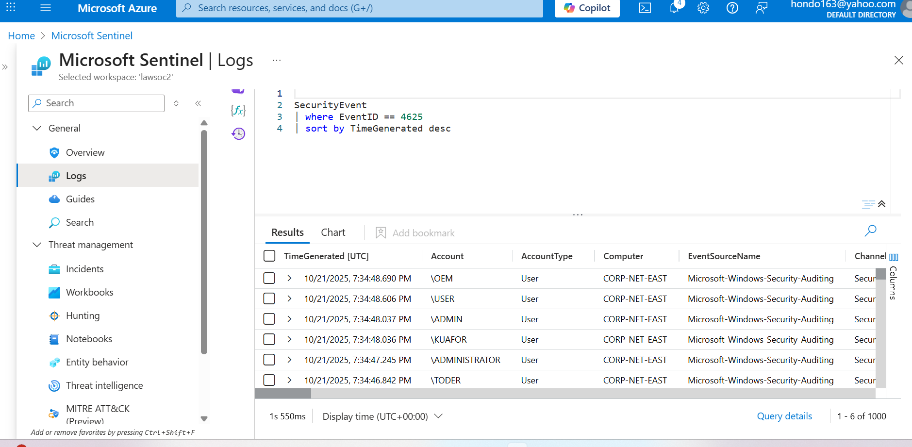

# Azure-Sentinel-SIEM-Honeypot-Home-Lab

# Description

Welcome to the Azure Sentinel Honeypot Homelab walkthrough! In this guide, we will explore how to set up and utilize a powerful and educational Homelab using Microsoft Azure Sentinel. Honeypots are decoy systems designed to attract and monitor malicious activity, providing valuable insights into potential threats and attackers' tactics. A SIEM (Security Information and Event Management) is a comprehensive security solution that helps organizations collect, analyze, and respond to security events in real-time. With Azure Sentinel, Microsoft's cloud-native SIEM (Security Information and Event Management) solution, we can gain a comprehensive view of security events and automate threat detection and response. Unleash the power of our homelab where cybersecurity meets innovation! Track and log attacks from around the globe and witness our mesmerizing attack map take shape. Discover the thrilling world of cyber warfare with us!

# Learning Objectives

Setting up and rolling out various Azure components including Virtual Machines (VMs), Log Analytics Workspaces, and Azure Sentinel
Competence and experience with Microsoft Azure Sentinel, a SIEM (Security Information and Event Management) Log Management Tool
Third-party API Calls
Using KQL to query logs
Learn how to read the Security Event Logs in Windows
Utilize Workbooks (World Map) to make an interactive map showing attack statistics

# Technologies + Requirements

Microsoft Azure + Account
Azure Services: Sentinel, Log Analytics Workspace, Workbooks, Network Security Groups
Powershell
Remote Desktop Protocol (RDP)
Third-party API: ipgeolocation.io
Customized Powershell Script authored by Josh Madakor

# Overview:

## Table of Contents
- [Architecture](docs/architecture.md)
- [Detection Query](queries/failed-logons.kql)
- [Screenshots](#screenshots)
- [Lessons Learned](#lessons-learned)

## Screenshots

This lab simulates failed login attacks using a honeypot VM in Azure...

## Lessons Learned

- How to configure a honeypot VM and NSG to simulate attacks
- How to ingest logs using AMA and DCR
- How to enrich data with GeoIP using `externaldata()`
- How to visualize threats in Sentinel Workbooks
