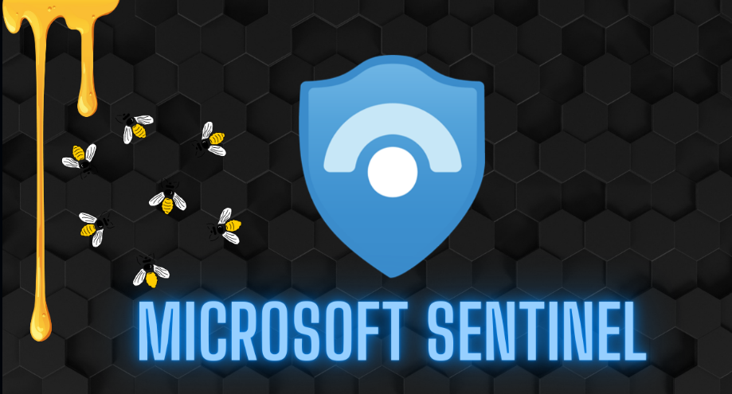

# Azure-Sentinel-SIEM-Honeypot-Home-Lab
This lab simulates failed login attacks using a honeypot VM in Azure, with logs ingested into Microsoft Sentinel. I use KQL to analyze attacker behavior and enrich data with GeoIP mapping. It’s a hands-on way to explore threat detection, log analysis, and SOC workflows.
