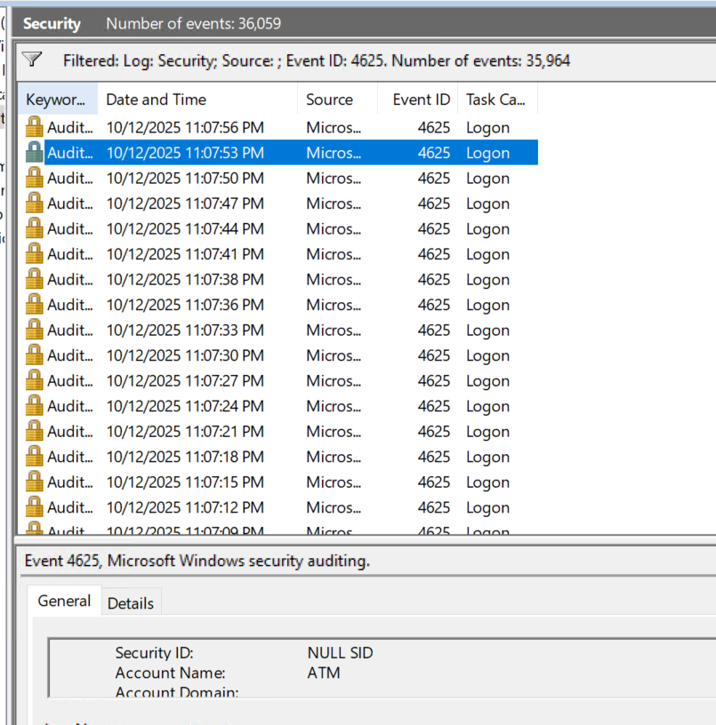
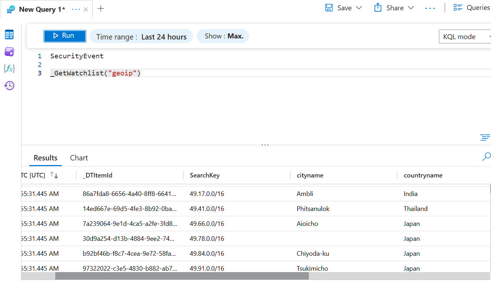
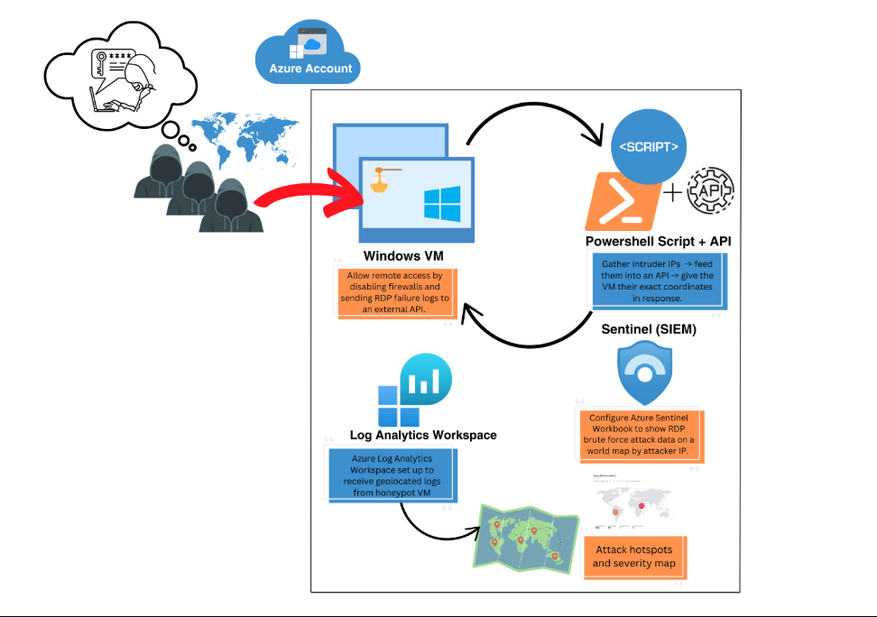

# Azure-Sentinel-SIEM-Honeypot-Home-Lab

# Description

Welcome to the Azure Sentinel Honeypot Homelab walkthrough! In this guide, we will explore how to set up and utilize a powerful and educational Homelab using Microsoft Azure Sentinel. Honeypots are decoy systems designed to attract and monitor malicious activity, providing valuable insights into potential threats and attackers' tactics. A SIEM (Security Information and Event Management) is a comprehensive security solution that helps organizations collect, analyze, and respond to security events in real-time. With Azure Sentinel, Microsoft's cloud-native SIEM (Security Information and Event Management) solution, we can gain a comprehensive view of security events and automate threat detection and response. Unleash the power of our homelab where cybersecurity meets innovation! Track and log attacks from around the globe and witness our mesmerizing attack map take shape. Discover the thrilling world of cyber warfare with us!

## Table of Contents
- [Architecture](docs/architecture.md)
- [Detection Query](queries/failed-logons.kql)
- [Screenshots](#screenshots)
- [Lessons Learned](#lessons-learned)

  ## Screenshots
This lab simulates failed login attacks using a honeypot VM in Azure...

## Lessons Learned
- How to configure a honeypot VM and NSG to simulate attacks
- How to ingest logs using AMA and DCR
- How to enrich data with GeoIP using `externaldata()`
- How to visualize threats in Sentinel Workbooks

# Learning Objectives
Setting up and rolling out various Azure components including: 
- Virtual Machines (VMs)
- Log Analytics Workspaces
- Azure Sentinel
- Competence and experience with Microsoft Azure Sentinel, a SIEM (Security Information and Event Management) Log Management Tool
- Third-party API Calls
- Using KQL to query logs
- Learn how to read the Security Event Logs in Windows
- Utilize Workbooks (World Map) to make an interactive map showing attack statistics

# Technologies + Requirements
- Microsoft Azure + Account
- Azure Services: Sentinel
- Log Analytics Workspace
-  Workbooks
- Network Security Groups
- Powershell
- Remote Desktop Protocol (RDP)
- Third-party API: [ipgeolocation.io](https://app.ipgeolocation.io/login)
- Customized Powershell Script authored by Josh Madakor

# Overview:
 

# Step 1: Create a Microsoft Azure Account: [Visit Azure](https://azure.microsoft.com/en-us/pricing/purchase-options/azure-account?icid=azurefreeaccount)
Microsoft offers $200 in Azure credit for 30 days when you initially sign up. Now as of 2025 I still had to put a card on file for the VM and zone I was using. I do not know if that will change in the future. I was still offered the $200 free. It has been about 3 weeks and so far I believe I have used maybe 20 dollars of the free money working 3+ hours at a time. You save money by having auto-shutdown turned on, but I just manually shut it down because it would shutdown my lab when I was working late at night so turn on auto-shutdown or leave it off based on the time you work best.

