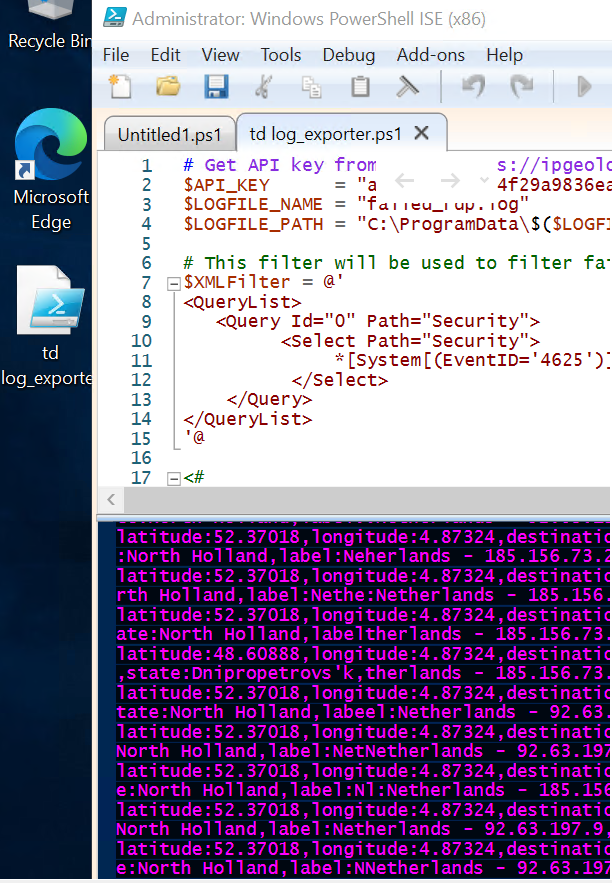
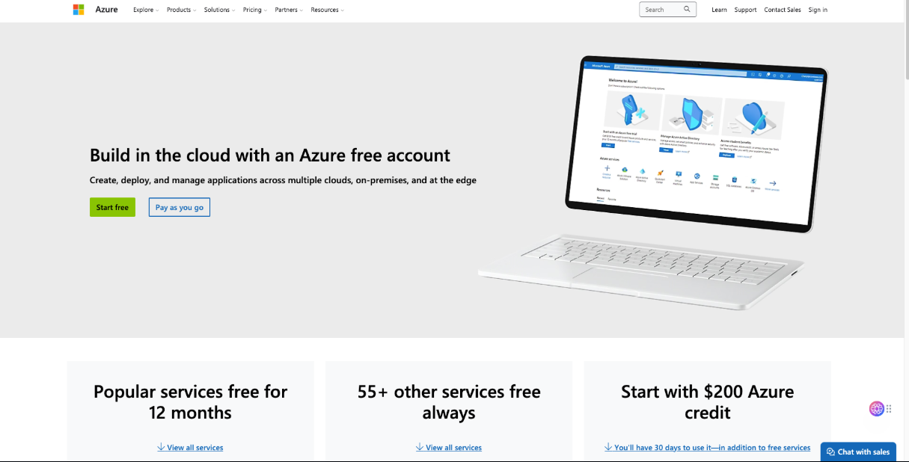

# Azure-Sentinel-SIEM-Honeypot-Home-Lab

# Description

Welcome to the Azure Sentinel Honeypot Homelab walkthrough! In this guide, we will explore how to set up and utilize a powerful and educational Homelab using Microsoft Azure Sentinel. Honeypots are decoy systems designed to attract and monitor malicious activity, providing valuable insights into potential threats and attackers' tactics. A SIEM (Security Information and Event Management) is a comprehensive security solution that helps organizations collect, analyze, and respond to security events in real-time. With Azure Sentinel, Microsoft's cloud-native SIEM (Security Information and Event Management) solution, we can gain a comprehensive view of security events and automate threat detection and response. Unleash the power of our homelab where cybersecurity meets innovation! Track and log attacks from around the globe and witness our mesmerizing attack map take shape. Discover the thrilling world of cyber warfare with us!

## Table of Contents
- [Architecture](docs/architecture.md)
- [Detection Query](queries/failed-logons.kql)
- [Screenshots](#screenshots)
- [Lessons Learned](#lessons-learned)

  ## Screenshots
This lab simulates failed login attacks using a honeypot VM in Azure...

## Lessons Learned
- How to configure a honeypot VM and NSG to simulate attacks
- How to ingest logs using AMA and DCR
- How to enrich data with GeoIP using `externaldata()`
- How to visualize threats in Sentinel Workbooks

# Learning Objectives
Setting up and rolling out various Azure components including: 
- Virtual Machines (VMs)
- Log Analytics Workspaces
- Azure Sentinel
- Competence and experience with Microsoft Azure Sentinel, a SIEM (Security Information and Event Management) Log Management Tool
- Third-party API Calls
- Using KQL to query logs
- Learn how to read the Security Event Logs in Windows
- Utilize Workbooks (World Map) to make an interactive map showing attack statistics

# Technologies + Requirements
- Microsoft Azure + Account
- Azure Services: Sentinel
- Log Analytics Workspace
-  Workbooks
- Network Security Groups
- Powershell
- Remote Desktop Protocol (RDP)
- Third-party API: [ipgeolocation.io](https://app.ipgeolocation.io/login)
- Customized Powershell Script authored by Josh Madakor

# Overview:
 

# Step 1: Create a Microsoft Azure Account: [Visit Azure](https://azure.microsoft.com/en-us/pricing/purchase-options/azure-account?icid=azurefreeaccount)
Microsoft offers $200 in Azure credit for 30 days when you initially sign up. Now as of 2025 I still had to put a card on file for the VM and zone I was using. I do not know if that will change in the future. I was still offered the $200 free. It has been about 3 weeks and so far I believe I have used maybe 20 dollars of the free money working 3+ hours at a time. You save money by having auto-shutdown turned on, but I just manually shut it down because it would shutdown my lab when I was working late at night so turn on auto-shutdown or leave it off based on the time you work best.

# Step 2: Setup our honey pot virtual machine
Vulnerable Windows VM

# Basics
After signing up, click "Go to the Azure Portal" , or visit portal.azure.com
In the search bar type "virtual machines"
Under Create tab click on Azure virtual machine
# Project Details
Create a new resource group and give it a name (honeypot-lab) or whatever you want
A resource group is a container that helps organize and manage related cloud resources. (The way Josh explained it on yt it is like a file that made sense to me so whatever works for you)

# Instance Details
Give your virtual machine a name (honeypot-vm) ( I changed mine had to redo it a few times)
Choose a recommended region: ((US) East 2) (This is an important step I messed this up the 1st time around EVERYTHING has to be in the same zone you could choose West 3,North 2 whatever but once you choose a zone everything you create from this point on has to have the same zone or it will not work ask me how I know...-_-)

Availability options: No infrastructure redundancy required
Security type: Standard
Image: Windows Server 2019 Datacenter - x64 Gen2 ( is what I used) (Josh used Windows 10 Pro, version 22H2 - x64 Gen2 which is not available at the point of me writing this, only the Windows 11 version of pro was an option and that was not working for me so I went with the server)

VM Architecture: x64
Size: Default is fine (Standard_D2s_v3 – 2vcpus, 8 GiB memory)
# Administrator account
Set up a username and password for the virtual machine.
IMPORTANT: these identification details will be used to log into the virtual machine. (Make sure to keep them in mind and write down or store the user and pass you created)

# Inbount port rules
Public inbound ports -> Allow selected ports: RDP (3389)
# Licensing
Confirm Licensing
Select Next : Disks >
